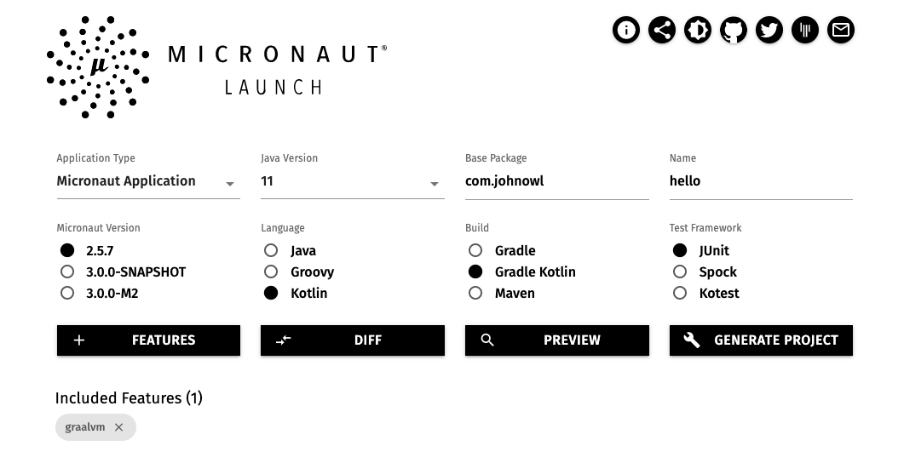
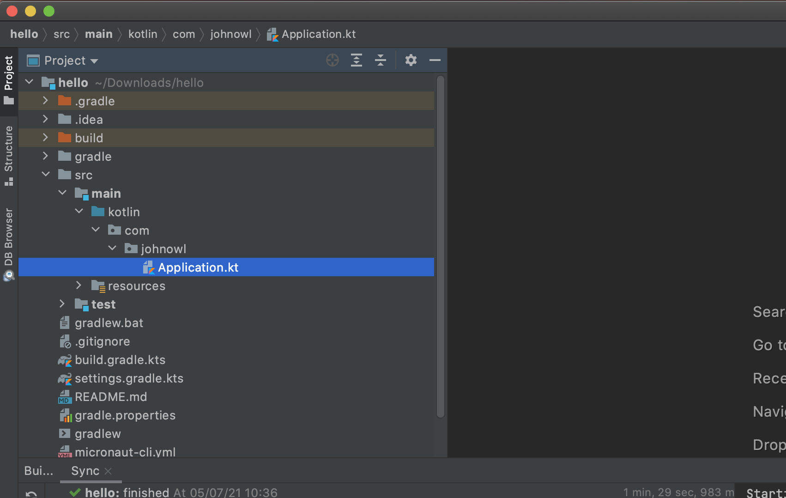
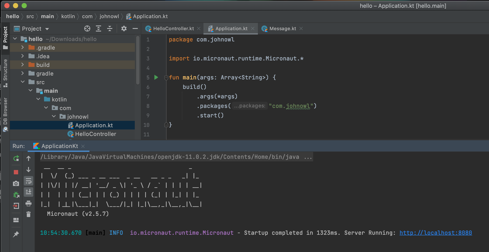
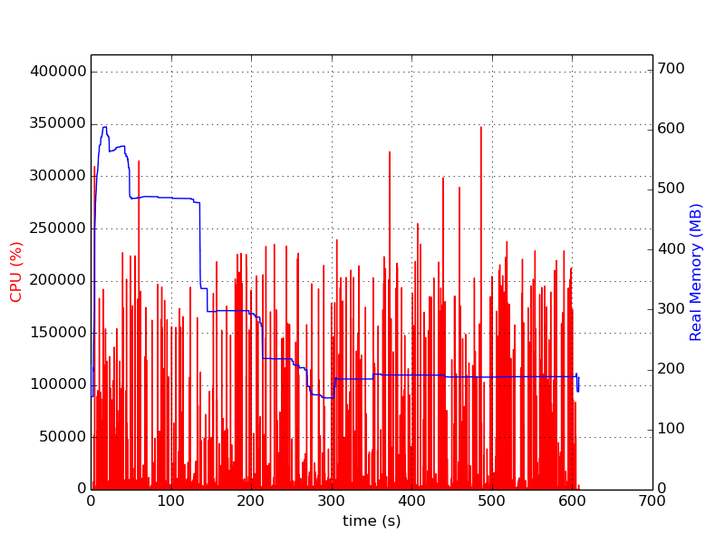
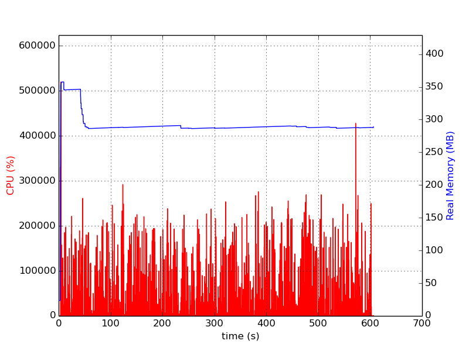

## Objetivo

Nosso objetivo é mostrar como criar um microsserviço usando a linguagem de programação Kotlin, o framework Micronaut e compilá-lo para código nativo usando a GraalVM. Também vamos descobrir se a compilação para código nativo da GraalVM é melhor do que rodar os bytecodes na JVM.

## Ferramentas

Os links abaixo levam para instruções de como instalar as ferramentas:

* [IntelliJ Community](https://www.jetbrains.com/pt-br/idea/download/)
* [GraalVM](https://www.graalvm.org/docs/getting-started/#install-graalvm)
* [GraalVM native image](https://www.graalvm.org/reference-manual/native-image/#install-native-image)

## Criando nosso microsserviço

O Micronaut framework oferece um aplicativo de linha de comando e um site para criação de novos projetos. Nesse tutorial vamos usar o site para deixar o processo mais simples. Siga os passos abaixo:

1. Acesse [https://micronaut.io/launch/](https://micronaut.io/launch/) e selecione ou preencha as opções conforme segue:
    * Application type: Micronaut Application
    * Java Version: 11
    * Base package: com.johnowl
    * Name: hello
    * Micronaut Version: 2.5.7
    * Language: Kotlin
    * Build: Gradle Kotlin
    * Test Framework: JUnit
2. Na mesma página, clique no botão "Features" e selecione a opção `graalvm` dentro da categoria `Packaging` e clique no botão `Done`
3. A página deve estar parecida com a imagem 
4. Clique no botão "Generate project" e selecione a opção "Download zip" no menu que será apresentado, o arquivo `hello.zip` será baixado para o seu computador.

## Criando nossa primeira API com Micronaut

1. Descompacte o arquivo `hello.zip` que foi gerado no passo anterior e abra o projeto no IntelliJ. Para abrir o projeto no Intellij, clique em `Open` na tela inicial do IntelliJ e navegue até o diretório `hello`.
2. Aguarde o download das dependências e navegue até `src/main/kotlin/com/johnowl`, veja a imagem: 
3. Clique com o botão direito do mouse em `johnowl` e adicione uma nova classe chamada `Message`
4. Altere a classe recém criada para que ela seja um `data class` com uma única propriedade `message` do tipo string, também adicione a annotation `@Introspected` na classe (vamos falar mais sobre essa annotation no capítulo seguinte). Seu arquivo deve ficar igual a esse:

    ```kotlin
    package com.johnowl

    import io.micronaut.core.annotation.Introspected

    @Introspected
    data class Message(
        val message: String
    )    
    ```

5. Clique com o botão direito do mouse em `johnowl` e adicione uma nova classe chamada `HelloController`
6. Adicione a annotation `@Controller` na classe recém criada
7. Também adicione um método chamado `getMessage`, anotado com `@Get("/")` e que retorne uma instância de `Message` com o texto "Hello world!", sua classe deve estar igual a essa:

    ```kotlin
    package com.johnowl

    import io.micronaut.http.annotation.Controller
    import io.micronaut.http.annotation.Get

    @Controller
    class HelloController {

        @Get( "/")
        fun getMessage(): Message {
            return Message("Hello world!")
        }

    }
    ```

## Vamos rodar nossa aplicação

Abra o arquivo `Application.kt` e clique no triângulo verde ao lado de `fun main(args: Array<String>) {`, sua aplicação vai iniciar e estará disponível para ser chamada em `http://localhost:8080`.



Acesse o endereço `http://localhost:8080` em seu navegador web e receba uma resposta com o conteúdo JSON abaixo:

```text
{"message":"Hello world!"}
```

Você acabou de criar sua primeira API. Quem trabalha com Spring Framework pode notar algumas semelhanças entre as annotations do Spring e Micronaut. Isso é proposital, para reduzir a curva de aprendizado.

Você pode ter notado que até esse momento não precisamos da GraalVM para nada, isso porque uma aplicação Micronaut pode rodar em qualquer máquina virtual Java. No próximo capítulo vamos usar a GraalVM para compilar nossa aplicação para código nativo e faremos algumas comparações.

## Compilando sua aplicação para código nativo

Os compiladores podem ser divididos em dois grandes grupos: AOT e JIT. Compiladores AOT, ahead of time, compilam o código antes de sua execução. Já os compiladores JIT, just in time, compilam o código em tempo de execução. Até agora nossa aplicação estava rodando no compilador JIT da JVM, vamos compilá-lo usando o compilador AOT da GraalVM.

Para compilar para código nativo, invoque a tarefa `nativeImage` do gradle pela linha de comando e espere.

```bash
./gradlew nativeImage
```

Espere mesmo, o processo é demorado, aqui levou quase 5 minutos:

```text
$ ./gradlew nativeImage

> Task :kaptKotlin
Note: Writing reflect-config.json file to destination: META-INF/native-image/com/johnowl/reflect-config.jsonNote: Writing resource-config.json file to destination: META-INF/native-image/com/johnowl/resource-config.jsonNote: Creating bean classes for 1 type elements
> Task :nativeImage
[application:43351]    classlist:   5,860.47 ms,  0.96 GB
[application:43351]        (cap):   4,065.73 ms,  0.96 GB
[application:43351]        setup:   9,389.10 ms,  1.19 GB
[application:43351]     (clinit):   1,695.04 ms,  3.12 GB
[application:43351]   (typeflow):  43,437.00 ms,  3.12 GB
[application:43351]    (objects):  37,928.13 ms,  3.12 GB
[application:43351]   (features):   4,012.92 ms,  3.12 GB
[application:43351]     analysis:  90,326.03 ms,  3.12 GB
[application:43351]     universe:   3,633.90 ms,  3.04 GB
[application:43351]      (parse):  19,522.22 ms,  3.80 GB
[application:43351]     (inline):  29,461.52 ms,  4.54 GB
[application:43351]    (compile):  81,511.78 ms,  4.74 GB
[application:43351]      compile: 139,647.35 ms,  4.74 GB
[application:43351]        image:  17,813.62 ms,  4.62 GB
[application:43351]        write:   2,266.19 ms,  4.62 GB
[application:43351]      [total]: 269,187.29 ms,  4.62 GB
Native Image written to: {diretório raiz da sua aplicação}/build/native-image/application

BUILD SUCCESSFUL in 4m 38s
5 actionable tasks: 3 executed, 2 up-to-date

```

Nos logs é possível ver que a imagem nativa foi gravada no diretório `{diretório raiz da sua aplicação}/build/native-image/application`, navegue até esse diretório e execute sua aplicação.

```bash
$ cd build/native-image/
$ ./application 
 __  __ _                                  _   
|  \/  (_) ___ _ __ ___  _ __   __ _ _   _| |_ 
| |\/| | |/ __| '__/ _ \| '_ \ / _` | | | | __|
| |  | | | (__| | | (_) | | | | (_| | |_| | |_ 
|_|  |_|_|\___|_|  \___/|_| |_|\__,_|\__,_|\__|
  Micronaut (v2.5.7)

11:58:44.907 [main] INFO  io.micronaut.runtime.Micronaut - Startup completed in 32ms. Server Running: http://localhost:8080
```

Ao acessar o navegador, você deve ver o mesmo resultado da aplicação rodando na JVM.

## Por que eu tive que adicionar a anotação `@Introspected` na classe `Message`?

O Micronaut Framework não usa a reflexão nativa do Java, essa funcionalidade foi substituída por outra implementação que é executada em tempo de compilação. A vantagem disso é o menor uso de memória, no entanto você precisa marcar que a classe está disponível para introspecção, caso contrário, sua aplicação pode se comportar de maneira inesperada.

E se eu remover a anotação `@Introspected`, o que acontece? Se estiver usando a compilação para código nativo seu código será compilado normalmente, mas a serialização da classe em tempo de execução não será possível. A resposta da API será um JSON vazio. Se estiver executando sua aplicação pela JVM, a reflexão padrão do Java será usada e o comportamento da API será o esperado.

## Compilação nativa da GraalVM é melhor?

Se você está em busca de uma aplicação que inicia quase que instantaneamente, usa pouca memória e está autocontida em um único executável de tamanho reduzido, a compilação nativa é o caminho. O cenário de uso que se encaixa bem aqui são aplicações sem servidor como Lambdas da AWS, Cloud Functions da GCP ou Azure Functions.

Se sua preocupação maior é com a latência máxima ou a taxa de transferência que é suportada em caso de pico de acessos, é recomendado deixar o compilador JIT da JVM trabalhar para você. O compilador JIT da Java HotSpot VM compila as partes da sua aplicação de acordo com o uso, ou seja, as partes mais utilizadas serão otimizadas da melhor forma possível. Para ter esse benefício sua aplicação precisa ficar rodando por algum tempo, no teste de carga que eu fiz bastou 5 minutos para a versão da aplicação rodando na JVM estar usando menos memória que o Hello World compilado para código nativo.

A versão Enterprise da GraalVM possui [uma ferramenta para gerar perfis de execução de sua aplicação](https://www.graalvm.org/reference-manual/native-image/PGO/), esses perfis são usados no momento da compilação para gerar otimizações que aumentam a taxa de transferência. Para gerar esses perfis você precisa simular chamadas em sua aplicação, e se por acaso alguma parte da aplicação não tiver sido executada, o tempo de execução desse trecho pode ficar ainda pior do que na compilação sem o uso de perfis.

Outra diferença entre compilação AOT com a JIT, é que a compilação AOT gera acoplamento com a plataforma que ela foi compilada, ou seja, se você compilar uma aplicação em uma máquina Linux, ela só irá rodar nesse sistema operacional. Diferente do arquivo JAR, que pode rodar em qualquer plataforma.

## Teste de carga

Nossa aplicação não é o melhor exemplo de uma aplicação do mundo real, mesmo assim eu fiz um teste de carga para podermos analisar as diferenças. Os testes duraram 10 minutos cada, configurei 10 threads e não limitei o número de requisições por segundo nem o uso de memória das aplicações.

Uso de CPU e memória da aplicação compilada JIT


Uso de CPU e memória da aplicação compilada AOT


| Métrica | AOT | JIT | Considerações |
| -- | -- | -- | -- |
| Tempo para iniciar a aplicação | 23ms | 1.100ms | A versão compilada AOT foi 47X mais rápida |
| Uso de memória (pico) | 350MB | 600MB | A versão AOT gastou 71% menos memória no pico de utilização |
| Uso de memória (media) | 300MB | 200MB | Depois que estabilizou, a versão JIT economizou 50% de memória. |
| Taxa de transferência | 22.535qps | 41.227qps | A versão JIT serviu 83% mais requisições |
| Tempo de resposta medio | 0,443ms | 0,242ms | A versão JIT foi 83% mais rápida |

A tabela acima possui valores de memória aproximados. O repositório com o código do microsserviço e o script do teste de carga realizados podem ser encontrados em [https://github.com/johnowl/micronaut-hello-world](https://github.com/johnowl/micronaut-hello-world)
